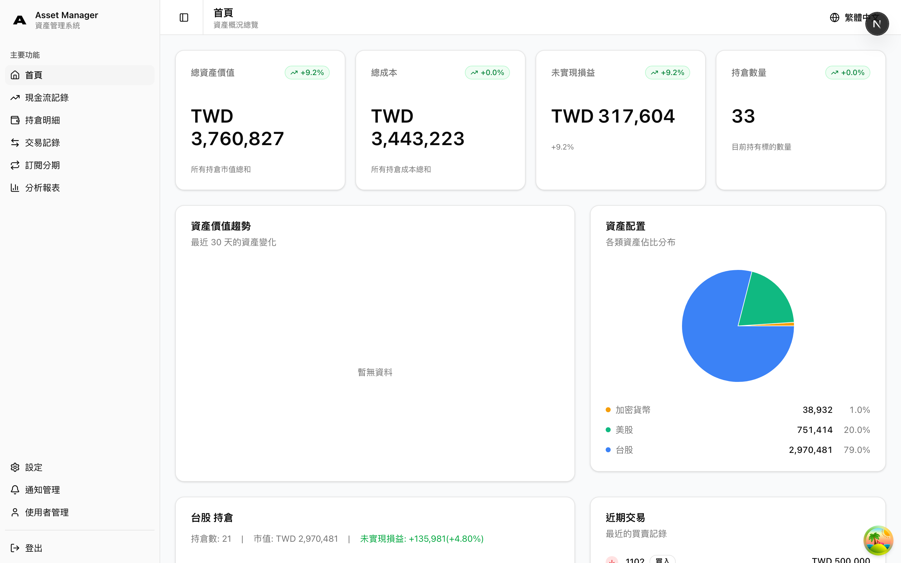
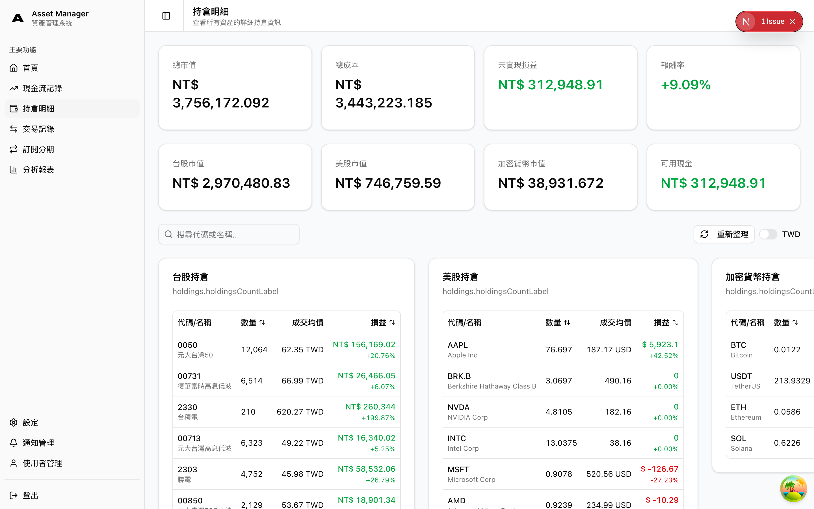
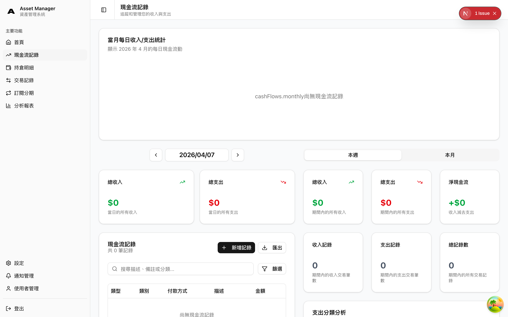
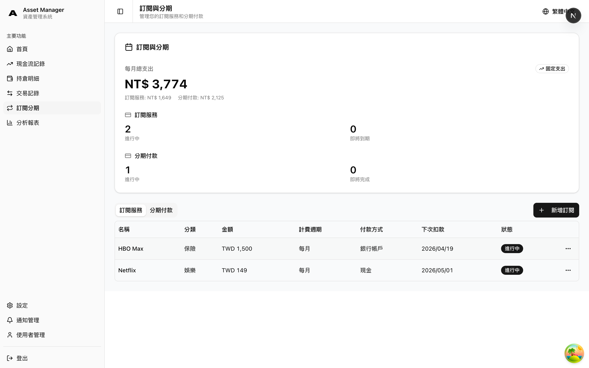
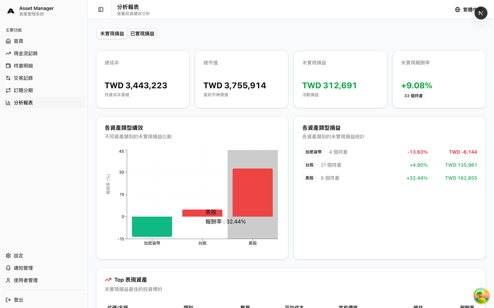

# Asset Manager

A full-stack personal finance management system for tracking investment portfolios, cash flows, subscriptions, installments, and financial analytics with real-time valuations and detailed reporting.

## Table of Contents

- [Overview](#overview)
- [Features](#features)
- [Tech Stack](#tech-stack)
- [Getting Started](#getting-started)
  - [Prerequisites](#prerequisites)
  - [Quick Start with Docker Compose](#quick-start-with-docker-compose)
  - [Manual Setup](#manual-setup)
- [Configuration](#configuration)
- [Project Structure](#project-structure)
- [Architecture](#architecture)
- [API Endpoints](#api-endpoints)
- [Development](#development)
- [Documentation](#documentation)
- [Contributing](#contributing)
- [License](#license)

## Overview

Asset Manager helps users manage personal finances across multiple asset types and financial accounts. It supports investment tracking for Taiwan stocks, U.S. stocks, cryptocurrencies, and cash holdings with FIFO cost basis calculations. Beyond investments, it handles cash flow categorization, recurring subscription billing, installment plans with interest, and bank/credit card account management.

The system provides analytics dashboards with realized/unrealized P&L, asset allocation breakdowns, performance trends via daily snapshots, and Discord webhook integration for automated reports.

## Features

- **Dashboard** -- At-a-glance portfolio value, return rate, asset allocation pie chart, and recent activity.

  

- **Multi-asset portfolio tracking** -- Buy, sell, dividend, fee, and tax transactions for Taiwan stocks, U.S. stocks, crypto, and cash. CSV import/export and batch creation supported.

  

- **FIFO cost basis and P&L** -- Automatic First-In, First-Out cost basis calculation with realized and unrealized profit/loss tracking.

- **Cash flow management** -- Income and expense tracking with predefined and custom categories, monthly/yearly reports, and summary statistics.

  

- **Subscription and installment billing** -- Recurring subscription management with automatic daily billing, installment tracking with interest calculations, expiration reminders, and auto-renewal.

  

- **Bank and credit card accounts** -- Multi-account support with credit card grouping.

- **Analytics and snapshots** -- Performance trends via daily snapshots, asset allocation by type and individual asset, top performing/underperforming assets, and time-range filtering.

  

- **Discord integration** -- Automated daily reports and alerts via webhook. Discord bot for natural-language bookkeeping, credit card bill payments, and account queries with confirmation flow (zh-TW/en). Graceful responses for unsupported requests and friendly greetings.
- **Authentication and settings** -- JWT-based authentication, role-based access, user preferences, and notification settings.
- **Exchange rate management** -- Multi-currency support with cached rates and graceful API degradation.

## Tech Stack

### Frontend

| Component | Technology |
|-----------|------------|
| Framework | Next.js 16 (App Router) |
| Language | TypeScript 5 |
| UI | shadcn/ui, Tailwind CSS 4 |
| State | TanStack Query 5 |
| Forms | react-hook-form 7 + zod |
| Charts | Recharts 2 |
| Package Manager | pnpm |

### Backend

| Component | Technology |
|-----------|------------|
| Language | Go 1.25 |
| Framework | Gin 1.11 |
| Database | PostgreSQL 12+ |
| Cache | Redis |
| Auth | JWT (golang-jwt v5) |
| Migrations | golang-migrate |
| Scheduling | robfig/cron v3 |
| Testing | testify 1.11 |
| Discord Bot | discordgo + Gemini 2.0 Flash |

### Infrastructure

| Component | Technology |
|-----------|------------|
| Containers | Docker, Docker Compose |
| Reverse Proxy | Nginx |
| Deployment | AWS EC2 |
| CI/CD | GitHub Actions |

## Getting Started

### Prerequisites

- **Go** >= 1.25
- **Node.js** >= 18 and **pnpm**
- **PostgreSQL** >= 12
- **Redis** (for caching and scheduling)
- **Docker** and **Docker Compose** (optional, for containerized setup)

### Quick Start with Docker Compose

```bash
git clone https://github.com/chienchuanw/asset-manager.git
cd asset-manager

# Copy and configure environment variables
cp .env.template .env.production
# Edit .env.production with your settings

# Start all services
docker-compose --env-file .env.production up -d
```

Backend API runs at `http://localhost:8080`, frontend at `http://localhost:3000`.

### Manual Setup

#### Backend

```bash
cd backend

cp .env.template .env
# Edit .env with your database credentials and API keys

go mod download

# Create databases
psql -U postgres -c "CREATE DATABASE asset_manager;"
psql -U postgres -c "CREATE DATABASE asset_manager_test;"

# Run migrations
make migrate-up

# Start the server
make run
```

The API server starts at `http://localhost:8080`.

#### Frontend

```bash
cd frontend

pnpm install

cp .env.template .env.local
# Edit .env.local -- set NEXT_PUBLIC_API_URL (default: http://localhost:8080)

pnpm dev
```

The frontend starts at `http://localhost:3001`.

## Configuration

The project uses environment variables configured via `.env` files. See `.env.template` at the project root for all available options.

| Variable | Description |
|----------|-------------|
| `DB_HOST`, `DB_PORT`, `DB_USER`, `DB_PASSWORD`, `DB_NAME` | PostgreSQL connection |
| `REDIS_ADDR`, `REDIS_PASSWORD`, `REDIS_DB` | Redis connection |
| `APP_PORT` | Backend API port |
| `GIN_MODE` | Gin framework mode (`debug` or `release`) |
| `JWT_SECRET` | Secret key for JWT token signing |
| `FINMIND_API_KEY` | FinMind API key for Taiwan stock prices |
| `COINGECKO_API_KEY` | CoinGecko API key for crypto prices |
| `ALPHA_VANTAGE_API_KEY` | Alpha Vantage API key for U.S. stock prices |
| `DISCORD_WEBHOOK_URL` | Discord webhook for automated reports |
| `AUTH_USERNAME`, `AUTH_PASSWORD` | Default admin credentials |
| `PRICE_CACHE_EXPIRATION` | Cache TTL for price data (e.g. `5m`) |
| `CORS_ALLOWED_ORIGINS` | Allowed CORS origins |
| `NEXT_PUBLIC_API_URL` | Backend API URL for the frontend |
| `SNAPSHOT_SCHEDULER_ENABLED` | Enable daily snapshot scheduler |
| `SNAPSHOT_SCHEDULER_TIME` | Time for daily snapshots |
| `DOMAIN`, `SSL_EMAIL` | SSL certificate configuration |

## Project Structure

```text
asset-manager/
├── backend/
│   ├── cmd/                  # Entry points (API server, seed, snapshot)
│   ├── internal/
│   │   ├── api/              # HTTP handlers
│   │   ├── service/          # Business logic
│   │   ├── repository/       # Data access layer
│   │   ├── models/           # Data models and DTOs
│   │   ├── middleware/       # Auth, CORS, logging middleware
│   │   ├── auth/             # JWT token handling
│   │   ├── cache/            # Redis caching
│   │   ├── client/           # HTTP client wrappers
│   │   ├── discord/          # Discord bot integration
│   │   ├── external/         # External API clients (prices, exchange rates)
│   │   ├── i18n/             # Internationalization resources
│   │   ├── scheduler/        # Cron task scheduling
│   │   └── db/               # Database connection
│   ├── migrations/           # SQL migration files (28 migrations)
│   └── scripts/              # Setup and test scripts
├── frontend/
│   ├── src/
│   │   ├── app/              # Next.js App Router pages
│   │   ├── components/       # React components
│   │   ├── hooks/            # Custom data-fetching hooks
│   │   ├── i18n/             # Internationalization setup
│   │   ├── lib/              # API client and utilities
│   │   ├── types/            # TypeScript type definitions
│   │   └── providers/        # Context providers
│   └── messages/             # i18n translation files (en, zh-TW)
├── scripts/                  # Deployment, backup, and SSL scripts
├── docker-compose.yml
├── nginx.conf
└── Makefile                  # Docker and deployment shortcuts
```

## Architecture

### Backend

The backend follows a clean architecture pattern with layered separation:

```text
HTTP Request
    |
Middleware (Auth, CORS, Logging)
    |
API Handler Layer (request parsing, response formatting)
    |
Service Layer (business logic, validation, orchestration)
    |
Repository Layer (SQL queries, data access)
    |
PostgreSQL / Redis
```

### Frontend

```text
Next.js Pages (App Router)
    |
React Components
    |
Custom Hooks (TanStack Query)
    |
API Client Layer
    |
Backend API
```

For detailed architecture documentation, see [`backend/doc/ARCHITECTURE.md`](backend/doc/ARCHITECTURE.md).

## API Endpoints

### Authentication

| Method | Path | Description |
|--------|------|-------------|
| POST | `/auth/login` | User login |
| POST | `/auth/register` | User registration |
| POST | `/auth/refresh` | Refresh JWT token |

### Transactions

| Method | Path | Description |
|--------|------|-------------|
| POST | `/api/transactions` | Create transaction |
| POST | `/api/transactions/batch` | Batch create transactions |
| GET | `/api/transactions` | List transactions (with filters) |
| GET | `/api/transactions/:id` | Get transaction by ID |
| PUT | `/api/transactions/:id` | Update transaction |
| DELETE | `/api/transactions/:id` | Delete transaction |
| GET | `/api/transactions/template` | Download CSV template |
| POST | `/api/transactions/parse-csv` | Parse CSV file |

### Holdings

| Method | Path | Description |
|--------|------|-------------|
| GET | `/api/holdings` | Get all holdings |
| GET | `/api/holdings/:symbol` | Get holding by symbol |

### Analytics

| Method | Path | Description |
|--------|------|-------------|
| GET | `/api/analytics/summary` | Analytics summary |
| GET | `/api/analytics/performance` | Performance data |
| GET | `/api/analytics/top-assets` | Top performing assets |
| GET | `/api/analytics/unrealized` | Unrealized P&L |

### Asset Allocation

| Method | Path | Description |
|--------|------|-------------|
| GET | `/api/allocation/current` | Current allocation |
| GET | `/api/allocation/by-type` | Allocation by asset type |
| GET | `/api/allocation/by-asset` | Allocation by individual asset |

### Cash Flows

| Method | Path | Description |
|--------|------|-------------|
| POST | `/api/cash-flows` | Create cash flow record |
| GET | `/api/cash-flows` | List cash flows (with filters) |
| GET | `/api/cash-flows/:id` | Get cash flow by ID |
| PUT | `/api/cash-flows/:id` | Update cash flow |
| DELETE | `/api/cash-flows/:id` | Delete cash flow |
| GET | `/api/cash-flows/summary` | Cash flow summary |

### Categories

| Method | Path | Description |
|--------|------|-------------|
| POST | `/api/categories` | Create category |
| GET | `/api/categories` | List categories |
| PUT | `/api/categories/:id` | Update category |
| DELETE | `/api/categories/:id` | Delete category |

### Subscriptions

| Method | Path | Description |
|--------|------|-------------|
| POST | `/api/subscriptions` | Create subscription |
| GET | `/api/subscriptions` | List subscriptions |
| GET | `/api/subscriptions/expiring-soon` | Expiring subscriptions |
| PUT | `/api/subscriptions/:id` | Update subscription |
| DELETE | `/api/subscriptions/:id` | Delete subscription |

### Installments

| Method | Path | Description |
|--------|------|-------------|
| POST | `/api/installments` | Create installment |
| GET | `/api/installments` | List installments |
| GET | `/api/installments/completing-soon` | Completing installments |
| PUT | `/api/installments/:id` | Update installment |
| DELETE | `/api/installments/:id` | Delete installment |

### Settings and Integrations

| Method | Path | Description |
|--------|------|-------------|
| GET | `/api/settings` | Get user settings |
| PUT | `/api/settings` | Update user settings |
| POST | `/api/discord/test` | Test Discord webhook |
| POST | `/api/discord/daily-report` | Send daily report |

For complete API documentation, see `backend/doc/`.

## Discord Bot (Natural Language Bookkeeping)

The system includes a Discord bot that allows you to record expenses, income, and credit card payments using natural language in a private Discord channel. The bot parses your message with Google Gemini AI, shows a preview, and creates the record after you confirm. Supports payment method selection, custom dates, and account queries.

**Bookkeeping examples:**
```
You: 午餐吃拉麵 180
Bot: 請選擇支付方式
     [▼ 現金 / 銀行帳戶 / 信用卡]

You: (selects 現金)
Bot: 📝 記帳預覽
     類型: 支出 | 金額: 180 | 分類: 飲食 | 描述: 午餐吃拉麵 | 日期: 2026-04-05 | 支付方式: 現金
     [✅ 確認記帳] [❌ 取消]

You: (clicks ✅)
Bot: ✅ 記帳成功
```

```
You: 刷卡買衣服 2000
Bot: 📝 記帳預覽  (skips payment selection -- inferred from 刷卡)
     類型: 支出 | 金額: 2,000 | 分類: 其他支出 | 描述: 刷卡買衣服 | 日期: 2026-04-05 | 支付方式: 信用卡
     [✅ 確認記帳] [❌ 取消]
```

**Credit card payment:**
```
You: 繳中信卡 15000
Bot: 請選擇要繳款的信用卡
     [▼ 中信 LINE Pay *1234 / 玉山 *5678]

You: (selects 中信 LINE Pay *1234)
Bot: 請選擇扣款銀行帳戶
     [▼ 台新 Richart *9012 / 中信 *3456]

You: (selects 台新 Richart *9012)
Bot: 💳 繳款預覽
     金額: 15,000 | 信用卡: 中信 LINE Pay *1234 | 扣款帳戶: 台新 Richart *9012 | 繳款類型: 自訂金額
     [✅ 確認繳款] [❌ 取消]

You: (clicks ✅)
Bot: ✅ 繳款成功
```

Full payment and minimum payment are also supported:
```
You: 繳玉山卡全額       -- auto-fills amount from current balance
You: 繳中信卡最低 3000  -- records minimum payment of 3,000
```

**Queries and other interactions:**
```
You: 這個月花了多少？
Bot: 📊 2026 年 4 月支出摘要 ...

You: 我的餘額多少？
Bot: 🏦 帳戶餘額 ...

You: 昨天午餐 180  (supports relative dates: 昨天, 前天, yesterday)
Bot: ... 日期: 2026-04-04 ...

You: 嗨
Bot: 👋 嗨！我是記帳小幫手 ...

You: 幫我買台積電 10 股
Bot: ❓ 目前不支援這項操作 (lists available features)
```

### Setup

1. Create a bot at [Discord Developer Portal](https://discord.com/developers/applications) → enable **MESSAGE CONTENT INTENT**
2. Get an API key at [Google AI Studio](https://aistudio.google.com/apikey) (free tier)
3. Enable Developer Mode in Discord → right-click your channel → Copy Channel ID
4. Set environment variables:

| Variable | Description |
|----------|-------------|
| `DISCORD_BOT_ENABLED` | `true` to enable the bot |
| `DISCORD_BOT_TOKEN` | Bot token from Discord Developer Portal |
| `DISCORD_CHANNEL_IDS` | Comma-separated channel IDs to listen in |
| `DISCORD_BOT_LANG` | `zh-TW` (default) or `en` |
| `GEMINI_API_KEY` | Google Gemini API key |

## Development

### Running Tests

```bash
# All backend tests
cd backend && make test

# Unit tests only (no database required)
make test-unit

# Integration tests (requires test database)
export TEST_DB_HOST=localhost TEST_DB_PORT=5432 TEST_DB_USER=postgres TEST_DB_PASSWORD=your_password TEST_DB_NAME=asset_manager_test
make test-integration
```

### Common Commands

```bash
# Backend
cd backend
make run              # Start API server
make lint             # Run linter
make fmt              # Format code
make migrate-up       # Apply migrations
make migrate-down     # Rollback migrations
make seed             # Seed test data

# Frontend
cd frontend
pnpm dev              # Start dev server
pnpm build            # Production build
pnpm tsc --noEmit     # Type check

# Docker (from project root)
make build            # Build Docker images
make up               # Start all containers
make down             # Stop all containers
make logs             # View container logs
make health           # Check service health
make backup           # Backup database
```

## Documentation

### Backend

- [`backend/doc/ARCHITECTURE.md`](backend/doc/ARCHITECTURE.md) -- System architecture
- [`backend/doc/QUICK_START.md`](backend/doc/QUICK_START.md) -- Quick start guide
- [`backend/doc/TESTING_GUIDE.md`](backend/doc/TESTING_GUIDE.md) -- Testing guide
- [`backend/doc/DEPLOYMENT.md`](backend/doc/DEPLOYMENT.md) -- Deployment guide
- [`backend/doc/ANALYTICS_COMPLETE_SUMMARY.md`](backend/doc/ANALYTICS_COMPLETE_SUMMARY.md) -- Analytics documentation

### Frontend

- [`frontend/doc/PHASE_6_SUMMARY.md`](frontend/doc/PHASE_6_SUMMARY.md) -- Frontend implementation summary
- [`frontend/README.md`](frontend/README.md) -- Frontend setup guide

## Contributing

This is a personal project, but suggestions and feedback are welcome.

1. Fork the repository
2. Create a feature branch (`git checkout -b feature/your-feature`)
3. Write tests before implementation (TDD approach)
4. Commit your changes with meaningful messages in English
5. Push to the branch and open a Pull Request

```bash
# Run backend tests before submitting
cd backend && make test
```

## License

This project is licensed under the [MIT License](LICENSE).
